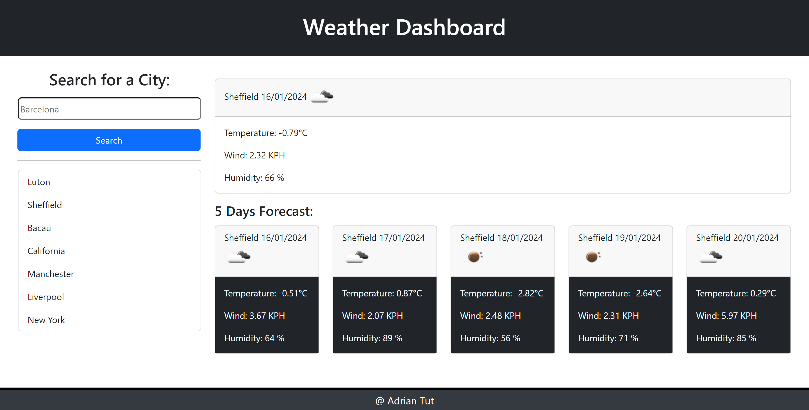

# Unit 8 Challenge: Weather-Dashboard-App

## Description

Introducing our Weather Dashboard App, your go-to destination for real-time weather information and a 5-day forecast for any city worldwide! With a sleek and user-friendly interface crafted using HTML, CSS, and JavaScript, this app seamlessly integrates the power of the OpenWeatherMap API to deliver accurate and up-to-date weather data. Experience the convenience of searching for weather conditions in any city, complemented by an intuitive design enhanced with JQuery and JQuery UI. Whether you're planning a trip, checking in on loved ones, or simply staying informed, our Weather Dashboard App provides a reliable and visually appealing platform for all your weather-related needs. Powered by DayJS and enriched with Bootstrap, this app ensures a responsive and enjoyable experience, bringing the world's weather to your fingertips. Stay ahead of the forecast with our Weather Dashboard App – where simplicity meets precision!

This website was deployed and you can see it live here: https://adriantutuianu.github.io/weather-dashboard-app-challenge/

## Installation

N/A

## Usage

## Credits

Edx Front End Web Bootcamp

## License

MIT License
